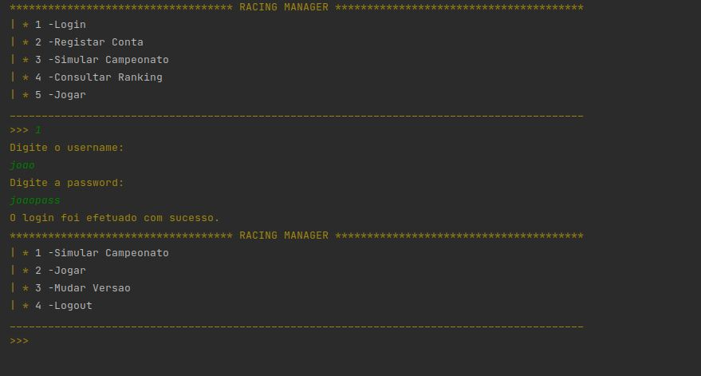
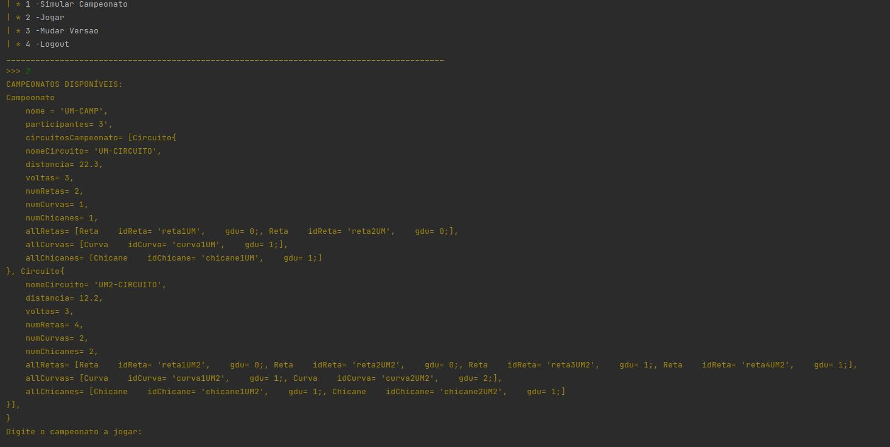
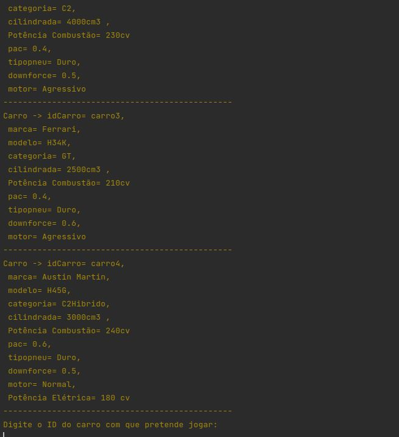
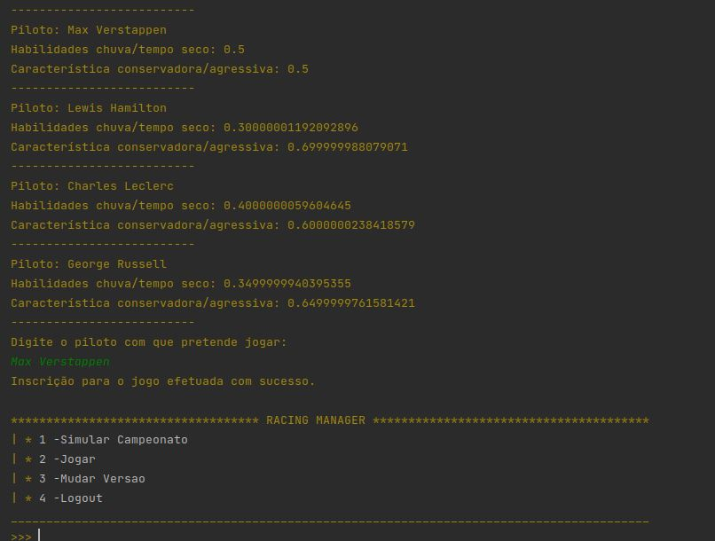
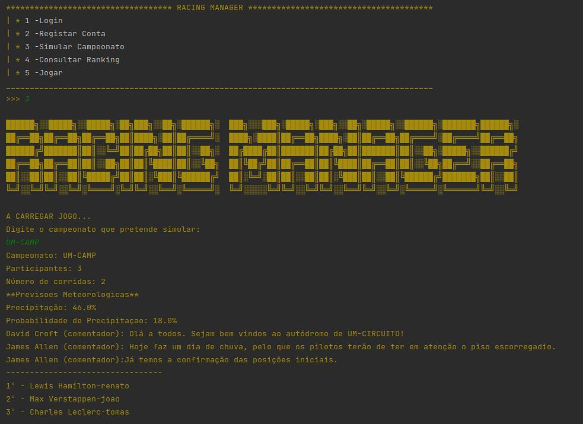
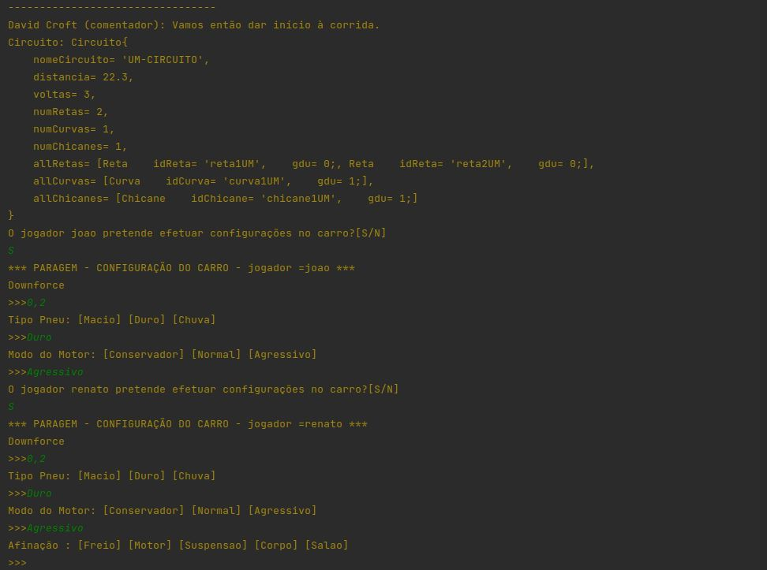
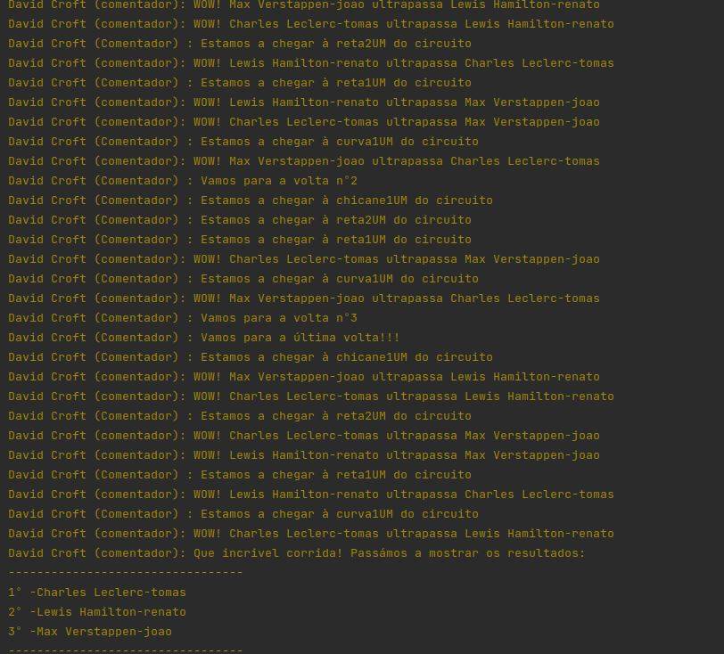
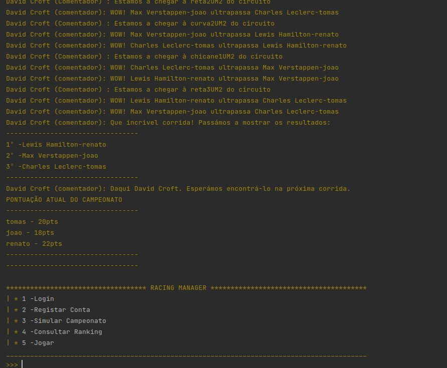

# DSS22-23-GP1

Racing Manager is a system that allows you to simulate car racing championships. The genesis of the application is similar to the F1 Manager game. The application is, in its essence, a game, in which registered users compete in car races that the software will simulate.
This application will host several users with different roles:
  - users who have an administrator role will be able to manage the championships and circuits that compose them, as so the cars and drivers that the system supports.
  - users who have a player role will be able to participate in a given championship that they want and will register for it. In this way, they will have to choose a car and a driver to participate in the race.
  
The user can carry out the championship registration either authenticated or as a guest, in which case it will not be necessary to login.
Each of the championships has a required number of participants, so it will only be possible to simulate that championship, when the number of registrations for the same is reached.
After the player authenticates correctly, he can start the game. Then the system will make available the existing championships in the game. Each of the championships has several circuits with straights, curves and chicanes. In this way, the player will be able to choose the desired championship, according to the difficulties of the course, or its distance.
After the player has selected the championship he wants to compete in, the system provides a list of all saved cars. For each of the cars, the characteristics inherent to them are illustrated depending on the category to which they belong.

Finally, the current player will choose the driver he wants to drive the previously chosen car. The system will provide a list of pilots for the player to analyze. For each of the pilots, a statistic is made of their driving skills.

When all participants are registered for the championship, the championship can be started. Thus, when the simulation starts, one of the players selects the championship and the weather conditions of the first race are presented, as well as the number of races and the constitution of the first track. Each of the players will be able to decide whether they want to make the desired mechanical changes to their cars according to the race conditions, even taking into account that they will only be able to carry out these configurations in 2/3 of the number of races in the championship in which they are participating. to participate. Depending on the car category they are playing with, they will be able to change settings that are characteristic of specific categories, such as the tuning for cars in C2 categories. At the beginning of the races there will be two commentators, "James Allen" and "David Croft", who will report on the conditions of the race and the circuit where it will take place, after which each of the players will be able to make the changes they want.

After introducing the settings, the simulation of the race itself will start. One of the commentators will report all the events of the race, namely overtaking, accidents, etc. After the end of each of the races, the commentator will present the final positions in which each of the players managed to reach. On the other hand, the scores of each player for the given championship are being counted.

<i>This project was done by:

[João Paulo Peixoto Castro](https://github.com/joaocasr) - A97223  
[Duarte Serrão](https://github.com/DuarteSerrao) - A83630  
[Tomás Dias](https://github.com/TrueEoM) - A89486  
[Renato Gomes](https://github.com/Reinas2899) - A84696  
</i>
***

Application Overview
------

  

  <b>Fig 1. authentication system. </b>

 

  

  <b>Fig 2. championship selection. </b>

 

  

  <b>Fig 3. car selection. </b>

 

  

  <b>Fig 4. driver system. </b>

 

  

  <b>Fig 5. race conditions. </b>

 

  

  <b>Fig 6. car boxes. </b>

 

  

  <b>Fig 7. race simulation. </b>

 

  

  <b>Fig 8. simulation's ending. </b>

 
